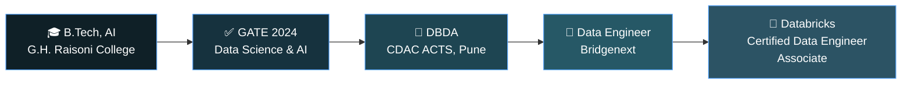

<div align="center">

# Hi There, I'm Arya 👋


<a href="https://www.linkedin.com/in/aryaai/">
  
</a>


<br/><br/>


<br/><br/>


</div>

<br/>

## 🧭 About Me

```yaml
role: Data Engineer @ Bridgenext
education: B.Tech in Artificial Intelligence — G.H. Raisoni College of Engineering (CGPA: 8.89)
postgrad: Diploma in Big Data Analytics (DBDA) — CDAC ACTS, Pune (2025)
qualification: GATE 2024 — Data Science & Artificial Intelligence
certification: Databricks Certified Data Engineer Associate (Feb 2026)
focus: Data Engineering · Distributed Computing · Applied Machine Learning
based_in: India
currently: Designing and optimizing data pipelines on Databricks & Microsoft Fabric
```

I'm a data engineer who enjoys the plumbing behind the data — moving it, cleaning it, and shaping it so it's actually usable. My path started in AI and Machine Learning during undergrad, moved through the Big Data Analytics diploma at CDAC ACTS Pune, and is now grounded in production data engineering with **Databricks**, **Microsoft Fabric**, and **Spark**. I still keep one foot in ML — I like understanding what happens to the data *after* the pipeline delivers it.

- 🎓 Completed the **DBDA (Diploma in Big Data Analytics)** from **CDAC ACTS, Pune** (2025)
- 💼 Working as a **Data Engineer at Bridgenext** since September 2025
- 🏅 **Databricks Certified Data Engineer Associate** (February 2026)
- 📜 **GATE 2024 Qualified** — Data Science & Artificial Intelligence (DA)
- ⚙️ Focused on building reliable, scalable data pipelines and lakehouse architectures
- 🌱 Continuously sharpening skills in distributed data processing and cloud-native engineering

---

## 🛠️ Tech Stack

<div align="center">

**Languages & Query**
<br/>


**Data Engineering & Cloud**
<br/>


**Tools & Platforms**
<br/>


</div>

---

## 📊 GitHub Analytics

<div align="center">
  
</div>

<div align="center">
  
</div>

---

## 🧬 My Journey So Far



---

## 📈 Skill Proficiency

| Skill | Level |
|---|---|
| Python | ████████░░ 85% |
| SQL | ████████░░ 80% |
| PySpark | ████████░░ 80% |
| Databricks | ███████░░░ 75% |
| Apache Spark | ███████░░░ 75% |
| Microsoft Fabric | ██████░░░░ 65% |

---

## 🏆 Highlights

<div align="center">


</div>

---

## 💼 Experience

<table>
<tr>
<td>

**Data Engineer** — Bridgenext
`September 2025 – Present`
Building and maintaining data pipelines using Databricks, Microsoft Fabric, and PySpark; using Great Expectations for data quality and validation; working across ingestion, transformation, and lakehouse-style data delivery for downstream analytics and reporting.

</td>
</tr>
<tr>
<td>

**Data Scientist & Social Media Manager** — IPL Scoop
`December 2023 – June 2024`
Built the "Run Chase Prediction" project and independently managed the company's social presence on X (formerly Twitter).

</td>
</tr>
</table>

---

## 🎓 Education & Certifications

- 🏫 **B.Tech, Artificial Intelligence** — G.H. Raisoni College of Engineering (CGPA: 8.89)
- 📘 **Diploma in Big Data Analytics (DBDA)** — CDAC ACTS, Pune, 2025
- 🏅 **Databricks Certified Data Engineer Associate** — February 2026
- ✅ **GATE 2024** — Data Science & Artificial Intelligence (DA)
- ☁️ **Google Cloud Program**
- 💻 **KLiC Certificate in C++ Programming** — Maharashtra Knowledge Corp. Ltd., Jan 2022

---

## 🌐 Languages

| Language | Proficiency |
|---|---|
| Marathi | Proficient |
| Hindi | Proficient |
| English | Intermediate |
| Punjabi | Basic |
| Japanese | Basic |

---

## 🎯 Currently Exploring

- 🔍 Advanced data pipeline design patterns on Databricks & Microsoft Fabric
- 📈 Distributed processing optimization with Spark/PySpark
- 🤝 Contributing to open-source data engineering projects
- 🧠 Keeping ML skills sharp alongside data engineering work

---

## ⚡ Beyond the Code

🔭 Stargazing · 🥾 Trekking · 📖 Exploring ancient texts · 🏸 Badminton · 📚 Reading · 📷 Chasing new places worth photographing

---

<div align="center">

### 📫 Let's Connect

<a href="https://www.linkedin.com/in/aryaai/">
  
</a>

<br/>

**Thanks for stopping by — always open to a conversation about data pipelines, lakehouses, or anything AI.**


</div>
